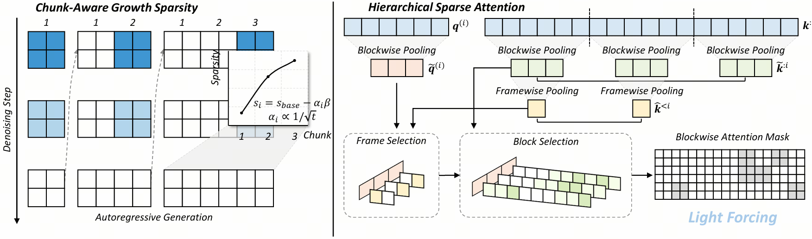
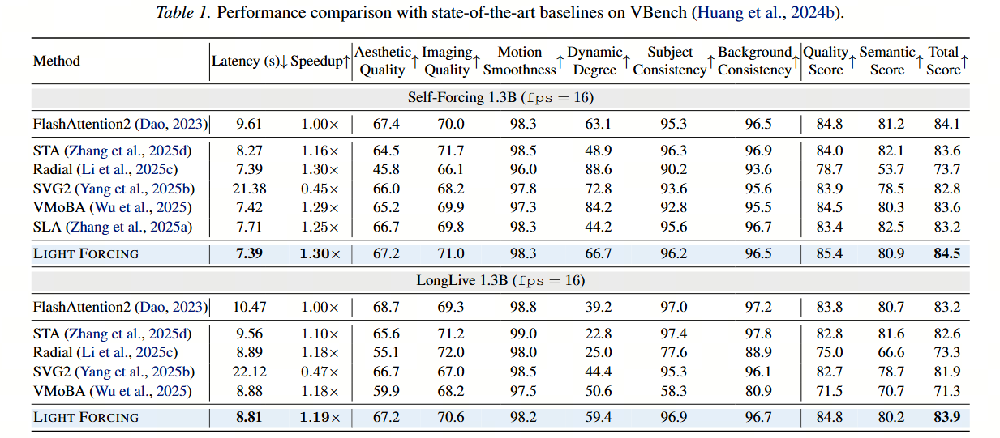

<h1> Light Forcing </h1>

<h3>Light Forcing: Accelerating Autoregressive Video Diffusion via Sparse Attention</h3>

[Chengtao Lv](https://scholar.google.com/citations?user=r8vseSUAAAAJ&hl=en&oi=ao), [Yumeng Shi](https://scholar.google.com/citations?user=z-jFDGMAAAAJ&hl=en&oi=ao), [Yushi Huang](https://harahan.github.io/),  [Ruihao Gong](https://xhplus.github.io/), [Shen Ren](https://sg.linkedin.com/in/shen-ren-5a378849), [Wenya Wang](https://personal.ntu.edu.sg/wangwy/)

[NTU](https://www.ntu.edu.sg/), [HKUST](https://hkust.edu.hk/), [Sensetime (LightX2V Group)](https://github.com/ModelTC/LightX2V)

<h1></h1>

https://github.com/user-attachments/assets/2daa9f17-329e-4019-8f14-68ac2c467592

<em>
    (Results on Self Forcing 1.3B. Left: Dense Attention. Right: 1.3x acceleration using Light Forcing) 
</em>

### 💡 Why Light Forcing  
* 🥇 Pioneer work: The first to explore **sparse attention acceleration** for autoregressive video generation.
* 🏆 Superior performance: Achieves a **VBench total score of 84.5**, delivering high-quality results with strong overall performance.
* 🚀 Significant acceleration: Provides **over 3× Attention speedup** and **1.2–1.3× end-to-end speedup**. up to **2.3× end-to-end acceleration** when combined with **FP8 and LightVAE** (19.7 FPS on a single RTX 5090 GPU).

### 🧾 Introduction
Advanced autoregressive (AR) video generation models have improved visual fidelity and interactivity, but the quadratic complexity of attention remains a primary bottleneck for efficient deployment. While existing sparse attention solutions have shown promise on bidirectional models, we identify that applying these solutions to AR models leads to considerable performance degradation for two reasons: isolated consideration of chunk generation and insufficient utilization of past informative context. Motivated by these observations, we propose Light Forcing, the first sparse attention solution tailored for AR video generation models. It incorporates a Chunk-Aware Growth mechanism to quantitatively estimate the contribution of each chunk, which determines their sparsity allocation. This progressive sparsity increase strategy enables the current chunk to inherit prior knowledge in earlier chunks during generation. Additionally, we introduce a Hierarchical Sparse Attention to capture informative historical and local context in a coarse-to-fine manner. Such two-level mask selection strategy (i.e., frame and block level) can adaptively handle diverse attention patterns. Extensive experiments demonstrate that our method outperforms existing sparse attention in quality (e.g., 84.5 on VBench) and efficiency (e.g., $1.2{\sim}1.3\times$ end-to-end speedup). Combined with FP8 quantization and LightVAE, Light Forcing further achieves a $2.3\times$ speedup and 19.7 FPS on an RTX 5090 GPU.

</img>

### 🧾 Results
</img>

### 🤝 Acknowledgments
We develop our code referring to the following repos:
- [Self Forcing](https://github.com/guandeh17/Self-Forcing)
- [LongLive](https://github.com/NVlabs/LongLive)
- [SLA](https://github.com/thu-ml/SLA)

### ✏️ Citation
If you find our toolkit or research paper useful or relevant to your research, please kindly cite our work. We are currently organizing the code, and it will be open-sourced upon the paper is accepted.
