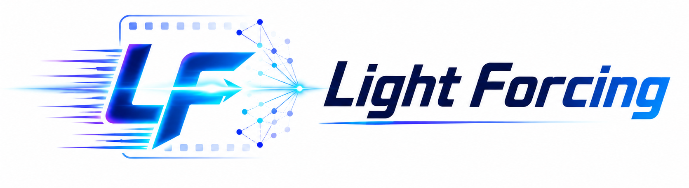
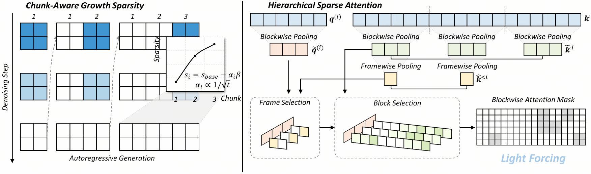


<div align="center" style="font-family: charter;">
<h1>Light Forcing:<br>Accelerating Autoregressive Video Diffusion via Sparse Attention</h1>



[](https://opensource.org/licenses/Apache-2.0)&nbsp;
[](https://arxiv.org/abs/2602.04789)&nbsp;
[](https://huggingface.co/mack-williams/Light-Forcing)&nbsp;
[](https://huggingface.co/spaces/hugging-apps/light-forcing-video-generation)&nbsp;
[](https://github.com/chengtao-lv/LightForcing)&nbsp;

[Chengtao Lv](https://scholar.google.com/citations?user=r8vseSUAAAAJ&hl=en&oi=ao), [Yumeng Shi](https://scholar.google.com/citations?user=z-jFDGMAAAAJ&hl=en&oi=ao), [Yushi Huang](https://harahan.github.io/), [Ruihao Gong](https://xhplus.github.io/)📧, [Shen Ren](https://sg.linkedin.com/in/shen-ren-5a378849), [Wenya Wang](https://personal.ntu.edu.sg/wangwy/)📧

[NTU](https://www.ntu.edu.sg/), [HKUST](https://hkust.edu.hk/), [Sensetime (LightX2V Group)](https://github.com/ModelTC/LightX2V)

(📧 denotes corresponding author.)


https://github.com/user-attachments/assets/2daa9f17-329e-4019-8f14-68ac2c467592


<em>
    (Results on Self Forcing 1.3B. Left: Dense Attention. Right: 1.3x acceleration using Light Forcing) 
</em>

</div>

### 💡 Why Light Forcing  
* 🥇 Pioneer work: The first to explore **sparse attention acceleration** for autoregressive video generation.
* 🏆 Superior performance: Achieves a **VBench total score of 84.5**, delivering high-quality results with strong overall performance.
* 🔌 Plug-and-play acceleration: This repository provides additional acceleration techniques, including **FP8 quantization**, **efficient kernels**, and an **efficient VAE**, enabling easy speedups with just a few lines of configuration.
* 🌐 Strong generality: Light Forcing is compatible with diverse GPUs (e.g., **RTX 5090**, **H100**, **A100**) and supports both short-video (e.g., **5s**) and long-video (e.g., **>10s**) generation.
* ⚡ Extreme acceleration: Achieves around **3.0× end-to-end speedup** on a single **RTX 5090** (**27.4 FPS**) and around **2.0× end-to-end speedup** on an **H100** (**33.9 FPS**).

### 🧾 Introduction
Advanced autoregressive (AR) video generation models have improved visual fidelity and interactivity, but the quadratic complexity of attention remains a primary bottleneck for efficient deployment. While existing sparse attention solutions have shown promise on bidirectional models, we identify that applying these solutions to AR models leads to considerable performance degradation for two reasons: isolated consideration of chunk generation and insufficient utilization of past informative context. Motivated by these observations, we propose Light Forcing, the first sparse attention solution tailored for AR video generation models. It incorporates a Chunk-Aware Growth mechanism to quantitatively estimate the contribution of each chunk, which determines their sparsity allocation. This progressive sparsity increase strategy enables the current chunk to inherit prior knowledge in earlier chunks during generation. Additionally, we introduce a Hierarchical Sparse Attention to capture informative historical and local context in a coarse-to-fine manner. Such two-level mask selection strategy (i.e., frame and block level) can adaptively handle diverse attention patterns. Extensive experiments demonstrate that our method outperforms existing sparse attention in quality (e.g., 84.5 on VBench) and efficiency (e.g., 1.2-1.3x end-to-end speedup). Combined with other efficient solutions, Light Forcing further achieves a 2.0-3.0x end-to-end speedup across diverse GPUs (e.g., 27.4 FPS on RTX 5090 and 33.9 FPS on H100).

</img>

## ✨ Quick Start

### Environment

We highly recommend using the Docker environment, as it is the simplest and fastest way to set up the environment. The Docker image already includes optimized kernels for Flash Attention 4 sparse attention, FP8 deployment, and RMSNorm.

```shell
docker pull lvchengtao/light_forcing:v1
```

> **Note:** The Docker image requires the host NVIDIA driver to support CUDA 13.0 or newer.

### Download Checkpoints

```shell
hf download Wan-AI/Wan2.1-T2V-1.3B --local-dir wan_models/Wan2.1-T2V-1.3B
hf download mack-williams/Light-Forcing --local-dir ./Light-Forcing
```

If you need to use LightVAE, run:

```shell
hf download lightx2v/Autoencoders lightvaew2_1.pth --local-dir ./Autoencoders
```

### Fast Inference

Before inference, you can adjust the configuration file to enable the desired acceleration techniques, such as sparse attention, LightVAE, FP8 quantization, and efficient kernels.

```yaml
long_video_gen: true  # Whether to enable long-video generation
sink_size: 1
sparse_config:
  sparsity: 0.88
  sparsity_base: 0.98
  keep_frames: 6  # Number of past frames to keep
  keep_sink: 1  # Number of sink frames to force keeping
  keep_near: 2  # Number of nearest frames to force keeping
  # other keys: BLKQ, BLKK
efficient_deployment:
  lightvae_path: path to lightvae ckpt
  quant_fp8: true  # Not supported on A100
  rmsnorm_kernel: true
  rope_kernel: true
  scale_shift_kernel: true
```

For short-video generation (e.g., 5s), run:

```shell
python inference.py \
  --config_path configs/light_forcing_short.yaml \
  --output_folder videos/light_forcing_short \
  --checkpoint_path path to short_video_gen.pt \
  --data_path prompts/MovieGenVideoBench_extended.txt \
  --use_ema
```

For long-video generation (e.g., 15s), run:

```shell
python inference.py \
  --config_path configs/light_forcing_long.yaml \
  --output_folder videos/light_forcing_long \
  --checkpoint_path path to long_video_gen.pt \
  --data_path prompts/MovieGenVideoBench_extended.txt \
  --use_ema \
  --num_output_frames 63
```

> **Note**
> 1. On RTX 5090 and A100 GPUs, Light Forcing calls the Triton sparse attention kernel. On H100 and other Hopper GPUs, it calls the Flash Attention sparse kernel.
> 2. If you use Hopper GPUs, we recommend setting `sparsity` and `sparsity_base` to `0.8` and `0.9`, respectively. Flash Attention 4 sparse attention currently supports a block size of 128, which is relatively coarse-grained, and further increasing sparsity does not bring additional speedup.

## 📊 Performance Benchmarks


### RTX 5090

<table border="0" style="width: 100%; text-align: left; margin-top: 20px;">
  <tr>
    <th>Metric</th>
    <th>Duration</th>
    <th>Flash Attention 2</th>
    <th>+Light Forcing<br>(88% sparsity)</th>
    <th>+FP8 linear</th>
    <th>+Efficient kernel<br>(RoPE, RMSNorm, etc.)</th>
    <th>+Light VAE</th>
  </tr>
  <tr>
    <td>Video</td>
    <td>5 seconds</td>
    <td><video src="https://github.com/user-attachments/assets/59988b4e-e31e-4924-a4de-5d5cee2c4266" width="100%" controls loop></video></td>
    <td><video src="https://github.com/user-attachments/assets/9219bb6f-d1d8-4837-816b-ac29a77e13f4" width="100%" controls loop></video></td>
    <td><video src="https://github.com/user-attachments/assets/7c374e46-de08-4a45-a006-d7adf8fc61cd" width="100%" controls loop></video></td>
    <td><video src="https://github.com/user-attachments/assets/a4e064ad-7d61-4120-a6f3-f8a68be8ccab" width="100%" controls loop></video></td>
    <td><video src="https://github.com/user-attachments/assets/7682c7ae-6ffc-4305-a51f-5569d7e8338a" width="100%" controls loop></video></td>
  </tr>
  <tr>
    <td>Latency</td>
    <td>5 seconds</td>
    <td>9.09s</td>
    <td>6.83s</td>
    <td>5.90s</td>
    <td>5.37s</td>
    <td>2.96s</td>
  </tr>
  <tr>
    <td>Speedup</td>
    <td>5 seconds</td>
    <td>1.00×</td>
    <td>1.33×</td>
    <td>1.54×</td>
    <td>1.69×</td>
    <td>3.07×</td>
  </tr>
  <tr>
    <td>Peak Memory</td>
    <td>5 seconds</td>
    <td>17.8G</td>
    <td>17.8G</td>
    <td>16.6G</td>
    <td>15.8G</td>
    <td>12.7G</td>
  </tr>
  <tr>
    <td>Video</td>
    <td>15 seconds</td>
    <td><video src="https://github.com/user-attachments/assets/746bb4ce-fa46-46eb-9de5-b7925976d1de" width="100%" controls loop></video></td>
    <td><video src="https://github.com/user-attachments/assets/9d8fcdd7-cb81-4539-ab45-acff5a754e7f" width="100%" controls loop></video></td>
    <td><video src="https://github.com/user-attachments/assets/b5d79bc5-969a-4125-b15c-32b7e3db327a" width="100%" controls loop></video></td>
    <td><video src="https://github.com/user-attachments/assets/daa46c3f-20c2-4920-8536-bf580f2d15e1" width="100%" controls loop></video></td>
    <td><video src="https://github.com/user-attachments/assets/2e5fc265-4ba4-481e-acfe-f716cb8f4e5f" width="100%" controls loop></video></td>
  </tr>
  <tr>
    <td>Latency</td>
    <td>15 seconds</td>
    <td>30.4s</td>
    <td>24.2s</td>
    <td>21.4s</td>
    <td>17.0s</td>
    <td>9.6s</td>
  </tr>
  <tr>
    <td>Speedup</td>
    <td>15 seconds</td>
    <td>1.00×</td>
    <td>1.26×</td>
    <td>1.42×</td>
    <td>1.79×</td>
    <td>3.17×</td>
  </tr>
  <tr>
    <td>Peak Memory</td>
    <td>15 seconds</td>
    <td>17.6G</td>
    <td>17.6G</td>
    <td>16.5G</td>
    <td>16.3G</td>
    <td>13.1G</td>
  </tr>
</table>

### A100

| Metric | Duration | Flash Attention 2 | +Light Forcing<br>(88% sparsity) | +Efficient kernel<br>(RoPE, RMSNorm, etc.) | +Light VAE |
| --- | --- | --- | --- | --- | --- |
| Latency | 5 seconds | 11.38s | 9.88s | 9.41s | 4.85s |
| Speedup | 5 seconds | 1.00× | 1.15× | 1.21× | 2.35× |
| Latency | 15 seconds | 38.28s | 34.56s | 26.63s | 18.08s |
| Speedup | 15 seconds | 1.00× | 1.11× | 1.44× | 2.12× |

### H100

| Metric | Duration | Flash Attention 3 | +Light Forcing<br>(80% sparsity) | +FP8 linear | +Efficient kernel<br>(RoPE, RMSNorm, etc.) | +Light VAE |
| --- | --- | --- | --- | --- | --- | --- |
| Latency | 5 seconds | 4.80s | 4.33s | 4.32s | 3.74s | 2.39s |
| Speedup | 5 seconds | 1.00× | 1.11× | 1.11× | 1.28× | 2.01× |
| Latency | 15 seconds | 15.8s | 14.1s | 13.8s | 12.1s | 8.0s |
| Speedup | 15 seconds | 1.00× | 1.12× | 1.14× | 1.31× | 1.98× |

* We record the generation time of a single video on one single GPU after operator warm-up, starting from the second sample.
* Efficient kernels such as RoPE, RMSNorm, and scale-shift are lossless acceleration methods.
* FP8 linear layers are near-lossless, while LightVAE may introduce slightly blurrier visual quality because it is designed for bidirectional video diffusion.
* Light Forcing has not yet been specifically optimized for A100 GPUs, and we plan to further optimize it in future updates.

### 🤝 Acknowledgments
We develop our code referring to the following projects:

* Video generation: [Self Forcing](https://github.com/guandeh17/Self-Forcing) and [Infinite-Forcing](https://github.com/SOTAMak1r/Infinite-Forcing).
* Sparse attention kernel: [Flash Attention 4](https://github.com/dao-ailab/flash-attention) and [SLA](https://github.com/thu-ml/SLA) (Triton).
* FP8 and RMSNorm kernel: [SGLang team](https://github.com/sgl-project/sglang).
* Light VAE: [LightX2V team](https://huggingface.co/lightx2v/Autoencoders).

### 🚀 Recommendation
We strongly recommend using **[LightX2V](https://github.com/ModelTC/LightX2V)**, a leading inference framework for video generation. LightX2V supports a wide range of autoregressive video generation models, including **[Self-Forcing](https://github.com/guandeh17/Self-Forcing)**, **[WorldPlay](https://github.com/Tencent-Hunyuan/HY-World-2.0)**, **[Matrix-Game](https://github.com/SkyworkAI/Matrix-Game)**, and **[LingBot-World](https://github.com/robbyant/lingbot-world)**.

It provides a comprehensive set of acceleration techniques, including **Weight Quantization** (FP8/NVFP4), **KV Cache Quantization**, **Offloading**, **Sparse Attention**, **LightVAE**, **Sequence Parallelism**, and **Kernel Fusion**.

### ✏️ Citation
If you find our toolkit or research paper useful or relevant to your research, please kindly cite our work.

```bibtex
@article{lv2026light,
  title={Light Forcing: Accelerating Autoregressive Video Diffusion via Sparse Attention},
  author={Lv, Chengtao and Shi, Yumeng and Huang, Yushi and Gong, Ruihao and Ren, Shen and Wang, Wenya},
  journal={arXiv preprint arXiv:2602.04789},
  year={2026}
}
```
